<div align="center">
  <h1>
    <br/>
    Sweet Delights - Cake Ordering App
  </h1>
  <h3>A Delightful Cake Ordering Application with Beautiful UI</h3>
</div>

<p align="center">
    <a href="https://github.com/jamalihassan0307/" target="_blank">
        
    </a>
    <a href="https://www.linkedin.com/in/jamalihassan0307/" target="_blank">
        
    </a>
</p>

## 📌 Overview

A beautifully designed Flutter application for ordering cakes with an elegant and intuitive UI. The app features smooth animations, seamless navigation, and a comprehensive ordering experience for delicious cakes and desserts.

## 🚀 Tech Stack

- **Flutter** (UI Framework)
- **Provider** (State Management)
- **Custom Animations**
- **Material Design**
- **Advanced Drawer**

## 🔑 Key Features

- ✅ **Category Filtering**: Browse cakes by type (Chocolate, Vanilla, etc.)
- ✅ **Favorites System**: Save and manage favorite cakes
- ✅ **Smart Search**: Find cakes by name or flavor
- ✅ **Shopping Cart**: Add and manage items in cart
- ✅ **Detailed Cake Views**: Comprehensive product information
- ✅ **Quantity Controls**: Adjust quantities in cart
- ✅ **User Profiles**: Personalized user experience
- ✅ **Modern UI**: Elegant and responsive interface
- ✅ **Onboarding Screens**: Smooth introduction to the app

## 📸 Banner

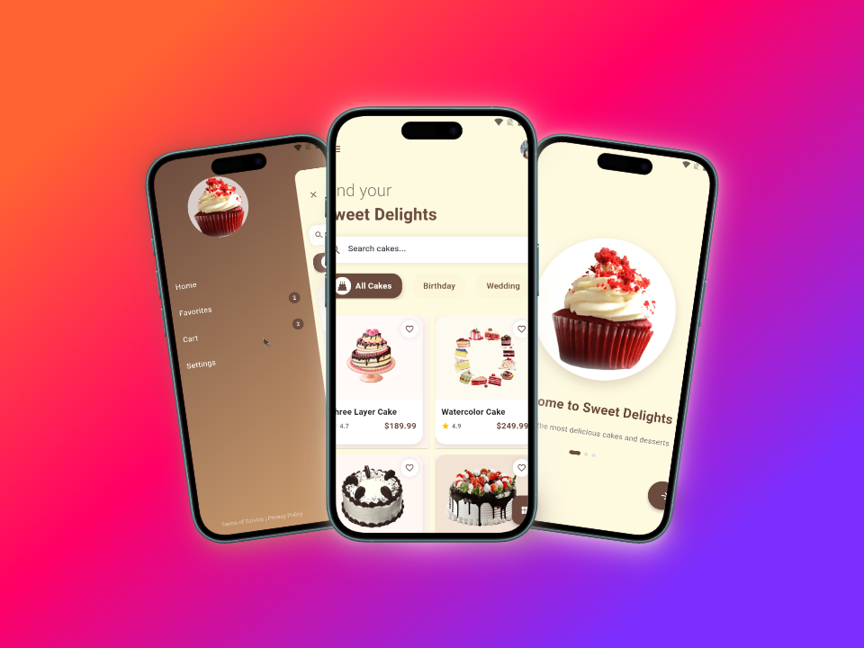

## 📸 Screenshots

### Main Features

<table border="1">
  <tr>
    <td align="center">
      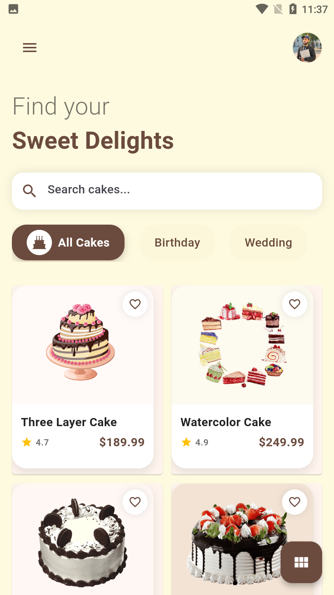
      <p><b>Home Screen</b></p>
    </td>
    <td align="center">
      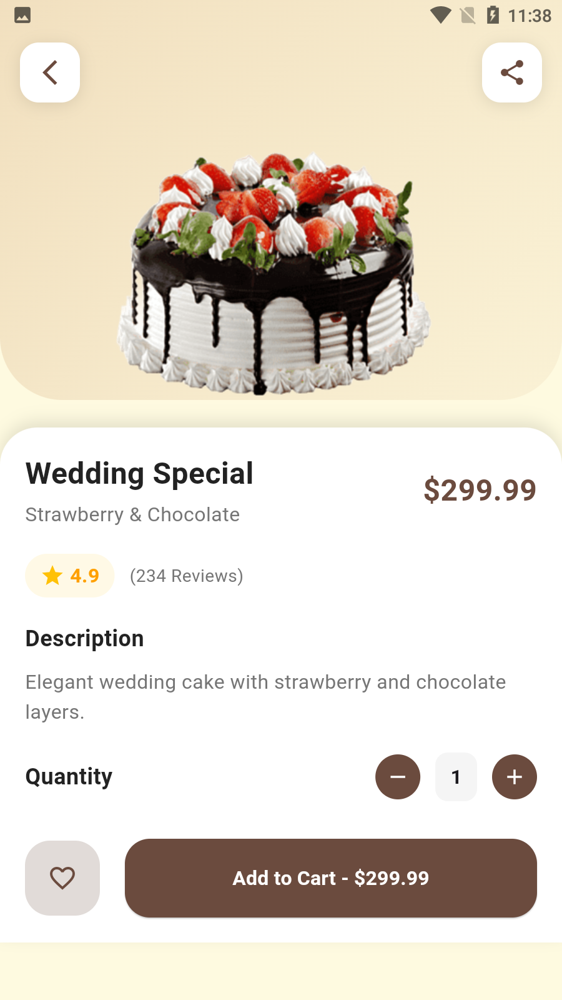
      <p><b>Cake Details</b></p>
    </td>
    <td align="center">
      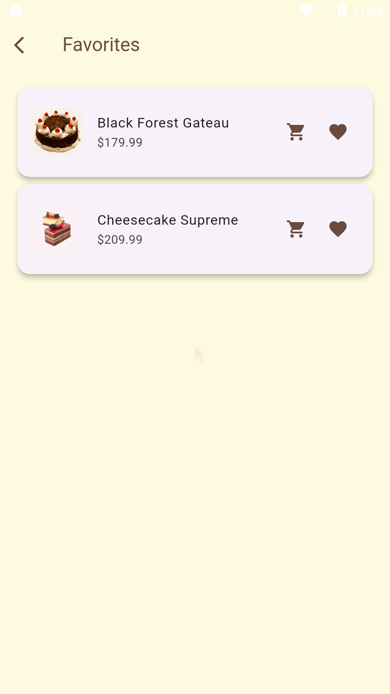
      <p><b>Favorites</b></p>
    </td>
  </tr>
  <tr>
    <td align="center">
      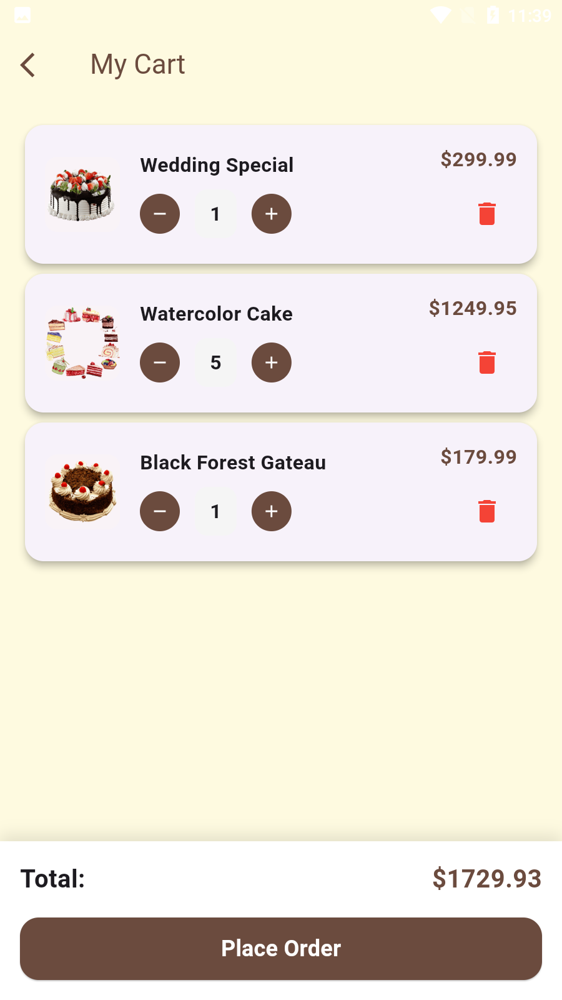
      <p><b>Shopping Cart</b></p>
    </td>
    <td align="center">
      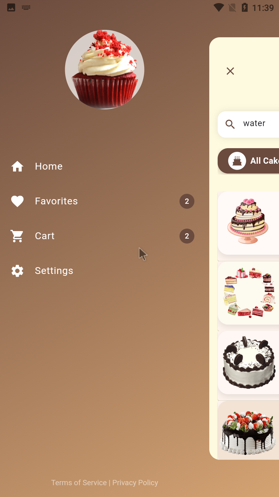
      <p><b>Navigation Drawer</b></p>
    </td>
    <td align="center">
      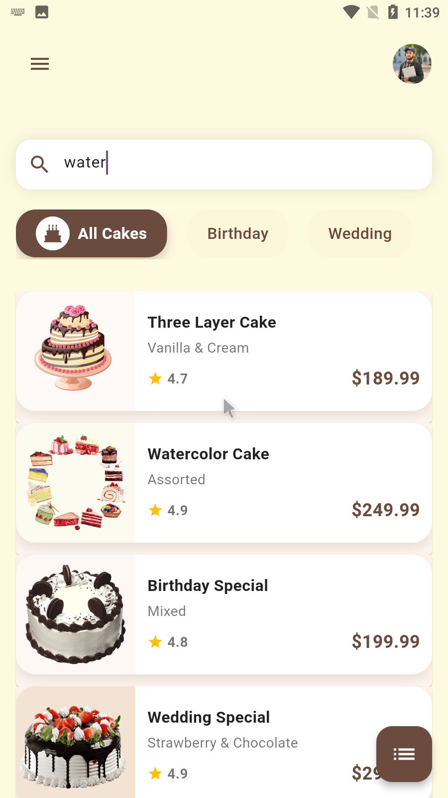
      <p><b>List View</b></p>
    </td>
  </tr>
</table>

### Filtering & User Experience

<table border="1">
  <tr>
    <td align="center">
      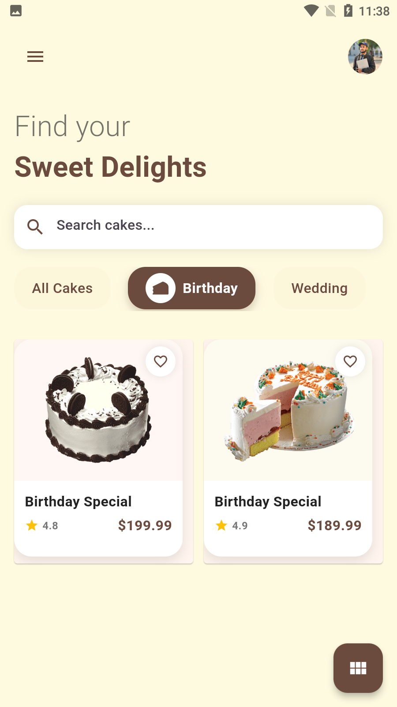
      <p><b>Category Filtering</b></p>
    </td>
    <td align="center">
      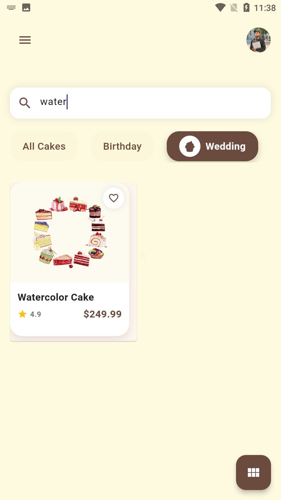
      <p><b>Search Functionality</b></p>
    </td>
    <td align="center">
      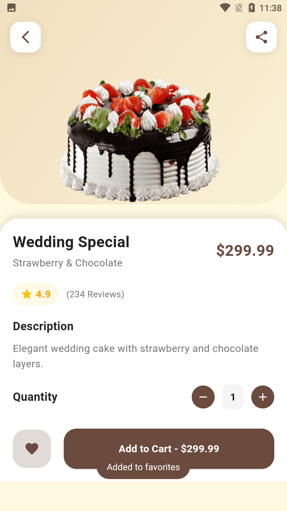
      <p><b>Add to Favorites</b></p>
    </td>
  </tr>
  <tr>
    <td align="center">
      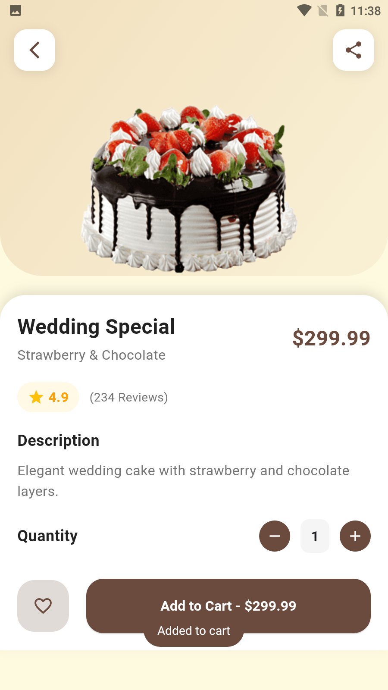
      <p><b>Add to Cart</b></p>
    </td>
    <td align="center">
      
      <p><b>Remove from Favorites</b></p>
    </td>
    <td align="center">
      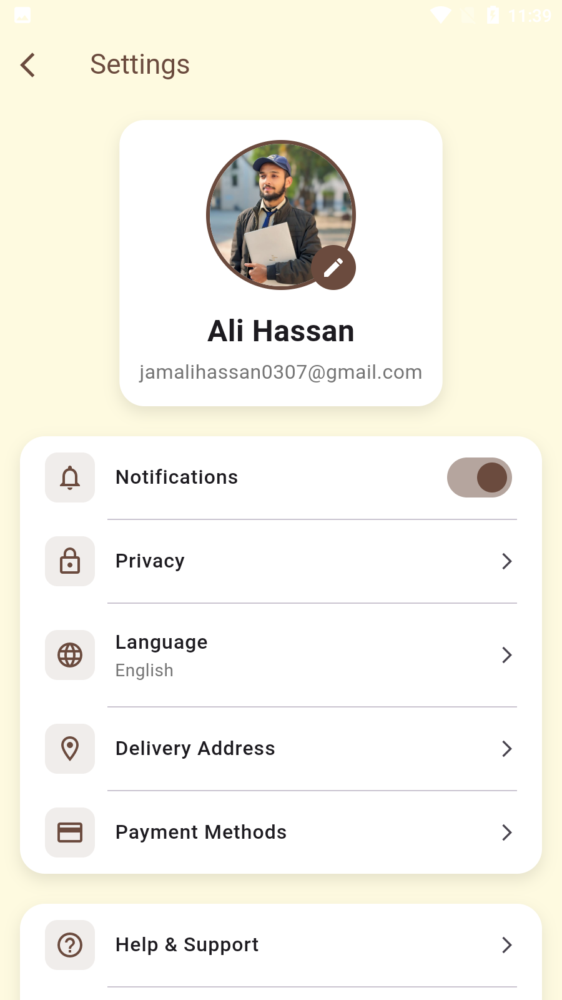
      <p><b>Settings</b></p>
    </td>
  </tr>
</table>

### Onboarding & Settings

<table border="1">
  <tr>
    <td align="center">
      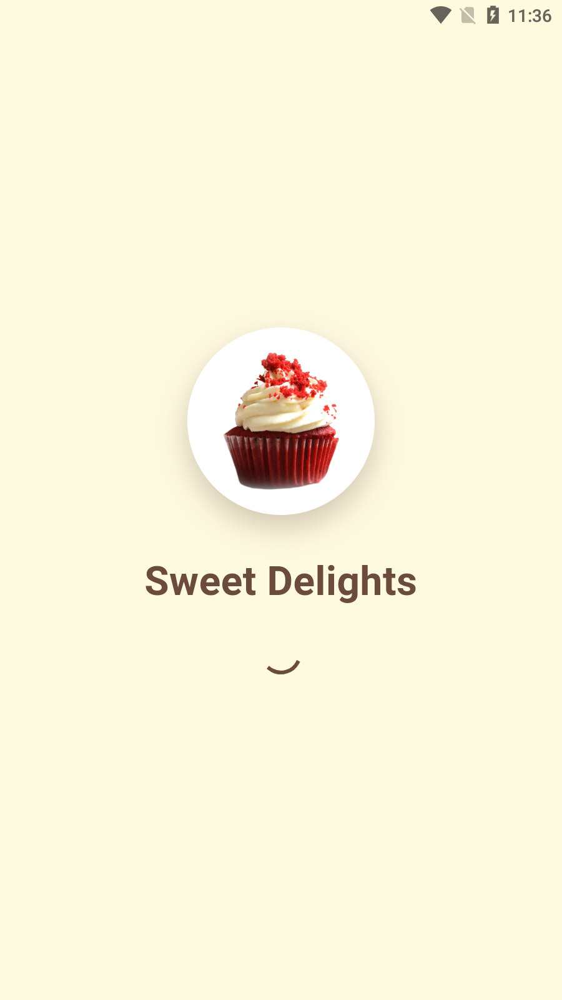
      <p><b>Splash Screen</b></p>
    </td>
    <td align="center">
      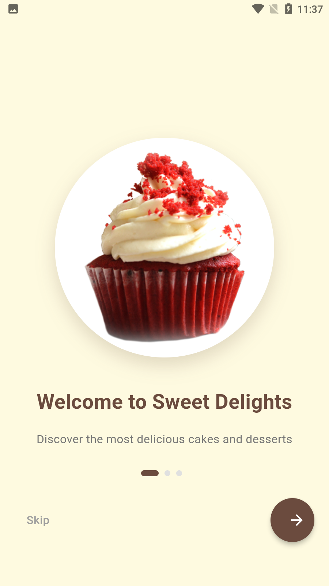
      <p><b>Walkthrough Screen 1</b></p>
    </td>
    <td align="center">
      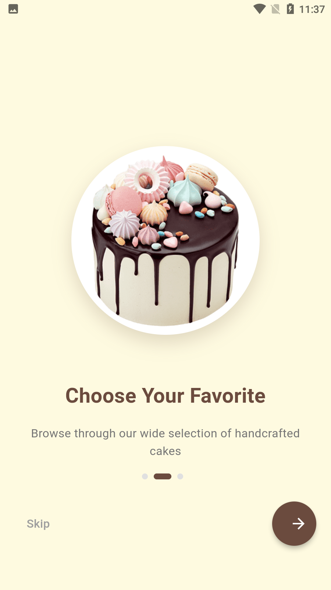
      <p><b>Walkthrough Screen 2</b></p>
    </td>
  </tr>
  <tr>
    <td align="center">
      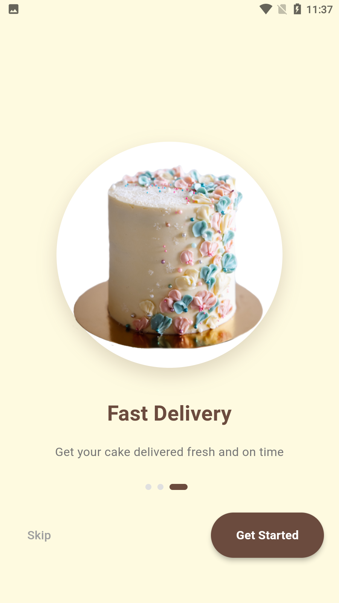
      <p><b>Walkthrough Screen 3</b></p>
    </td>
    <td align="center">
      
      <p><b>Settings</b></p>
    </td>
    <td align="center">
      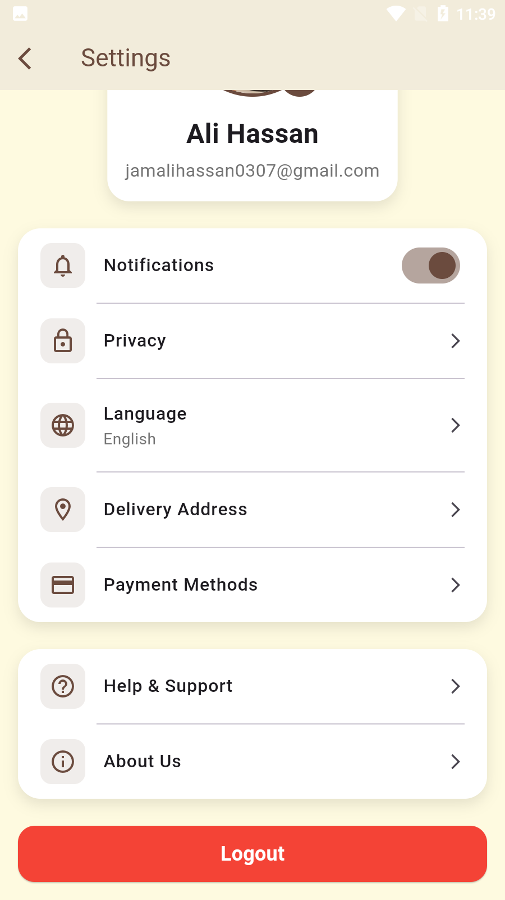
      <p><b>Settings Detail</b></p>
    </td>
  </tr>
</table>

## 📁 Project Structure

```
lib/
├── core/
│ ├── color.dart
│ └── text_style.dart
├── data/
│ ├── category.dart
│ └── items.dart
├── models/
│ └── cart_item.dart
├── page/
│ ├── cart_page.dart
│ ├── details_page.dart
│ ├── favorites_page.dart
│ ├── home_page.dart
│ ├── settings_page.dart
│ ├── splash_screen.dart
│ └── walkthrough_screen.dart
├── providers/
│ ├── cart_provider.dart
│ └── favorites_provider.dart
├── widget/
│ ├── Category_btn.dart
│ ├── item_card.dart
│ └── item_list_card.dart
└── main.dart
```

## 📱 Download APK

You can download the latest version of the app from:
[APK/app-armeabi-v7a-release.apk](APK/app-armeabi-v7a-release.apk)

## 👨‍💻 Developer

Developed by [Jam Ali Hassan](https://github.com/jamalihassan0307)

---

<p align="center">
  Made with ❤️ using Flutter
</p>
